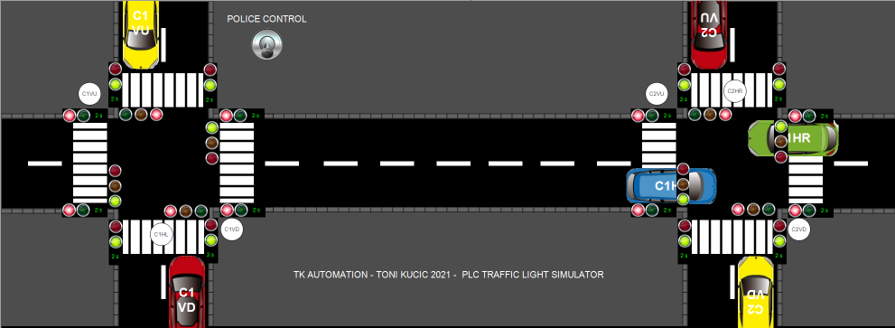

# PLC TRAFFIC CONTROL

Traffic control is often used a simple introduction into sequencing when programming PLCs. As a part of my portfolio I have written a simple timing controller and a simulator for two crossroads that are one way streets with pedestrians going in all directions. The project is meant for begginers and for educational purposes. It is published under MIT license. Written in CODESYS 3.5 and in structured text language.

## USAGE

The repository consists out of a CODESYS 3.5 project file, its generated PlcOpenXml and the serialized data in the docs folder.

* The codesys file can be opened with CODESYS and ran there.

* On different platforms than CODESYS the PlcOpenXml file can be used to import the data as no CODSYS native functions have been used in the project.

* Finally the user can read the code in markdown format located in this repository under docs folder or from this [link](docs/index_st.md)

## FUNCTIONAL DESCRIPTION

This is a program that needs to control two crossroads with cars and pedestrians. The crossroads are one way streets
so cars and pedestrians move in only one direction. It needs to control the traffic lights synchronously
so green wave is kept on the vertical and horizontal lines.
Pedestrian lights work opposite of the car lights so if the vertical line for the cars is green,
the horizontal pedestrians are not allowed to cross and vice versa.
For the pedestrians a time needs to be calculated to show when the green/red light is going to change.

This program implements the sequence diagram given below.

H R   0-30  
H Y   28-30 && 60-62  
H G   30-60  

V R   28-60  
V Y   26-28 && 58-60  
V G   0-26  && 60-62  

P H R 28-60  
P H G 0-28  

P V R 0-28  
P V G 28-60  

### SIMULATOR DESCRIPTION

The simulator moves the objects on the road/side walk until they reach a decision point. Decision points
are located next to the related traffic lights. The objects will move only if the traffic light is green
for their direction.
In the simulator the fault monitoring is also active which will stop the objects moving and freeze the lights
so the operator can check where it went wrong. It will also display a message on the screen with the location
and fault reason. During collission or dangerous lights combination all red lights will blink.
To get through the fault situation the operator must enable police control which puts all lights in blinking yellow mode.

## MODIFICATION FOR EDUCATIONAL PURPOSES

The project is designed in a way that the user can disable the main program and replace it with his own implementation. Simulator and the HMI sees only the IO global variables so if the user wishes to create an own implementation those variables should be written. On the simulator side the operator can see if the implementation is working correctly.

## LICENSE

This project is meant as a tutorial and as it it can be used under the MIT license.
